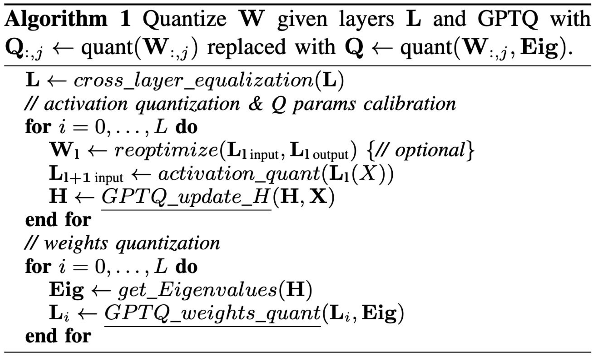
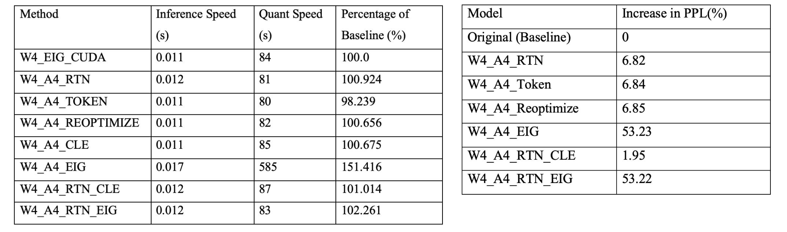

# GPTAQ

Neural Network Quantization Framework based on [GPTQ](https://github.com/IST-DASLab/gptq)
With addition of:
- Activations quantization (RTN + weight reoptimization + Token-wise)
- Hessian Eigenvalues in sensitivity params
- Cross-layer equalization

 
 

## Algorithm

## Experiments

