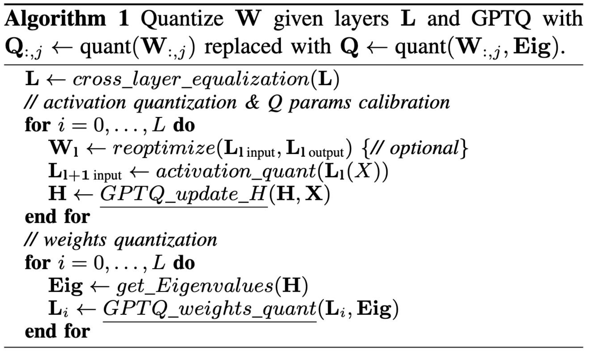
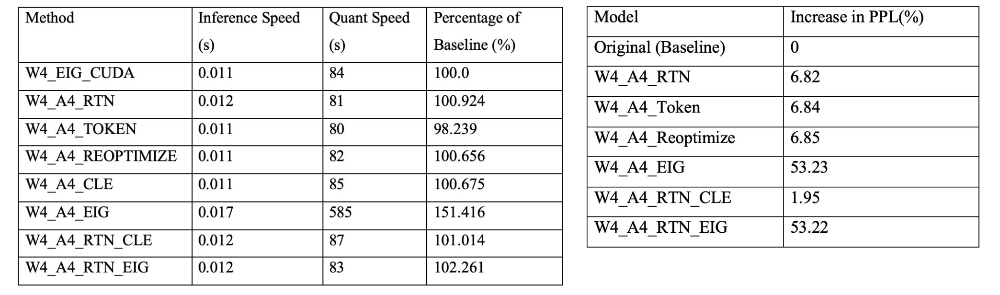

# GPTAQ

Neural Network Quantization Framework based on [GPTQ](https://github.com/IST-DASLab/gptq)
With addition of:
- Activations quantization (RTN + weight reoptimization + Token-wise)
- Hessian Eigenvalues in sensitivity params
- Cross-layer equalization

[GPTAQ on ResearchGate](https://www.researchgate.net/publication/383087167_GPTAQ_-Activation_Quantization_with_Cross_Layer_Equalization_for_GPTQ_Quantization_Framework_for_Neural_Networks)

 
 

## Algorithm

## Experiments

## Explanation

### Activation quantization
Extend uniform quantization from static weights to runtime activations by computing scale and zero-point from the tensor's **min/max** *(per-tensor, or per-token to isolate outliers)*. 
Or re-fitting weights by least squares (XᵀX)⁻¹XᵀY so the layer maps the quantized inputs back to the original outputs Y.

4 bits = 15 steps between min and max.

1. **RTN (per-tensor)**
- Activations [-0.4, 0.1, 0.2, **3.6**] → range 4.0 → step = 4.0/15 ≈ 0.27.
- Quantize 0.2 → nearest step is 0.13.
- Error 0.07 on a value of 0.2 = 33% off.
- The single outlier 3.6 stretched the grid for everyone.

2. **Token-wise**
- Compute min/max per token instead.
- A token without the outlier: [-0.4, 0.1, 0.2, **0.3**] → range 0.7 → step 0.047 → 0.2 becomes 0.207.
- Error 0.007, ~10× better.
- The outlier still hurts, but only its own token.

3. **Reoptimize**
- Don't fix the activations - fix the weights around them.
- 1-D: layer is y = 2x.
- True x = 1.0, quantized x̂ = 0.9 → output 1.8 instead of 2.0.
- Least-squares refit: w′ = 2.0/0.9 = 2.22 → w′·x̂ = 2.0 exactly.
- That's W = (X̂ᵀX̂)⁻¹X̂ᵀY - the weight absorbs the activation error.

### Hessian eigenvalues
The layer's Hessian H = XᵀX captures *second-order* (curvature/wall steepness) sensitivity of output error to weight perturbations.   
So its eigenvalues are used as per-direction weights in the MSE search for quantization parameters, biasing the grid toward accuracy in high-curvature directions. 

Quantizer tries ~100 candidate grids and normally picks the one with the smallest Σ(w−q)²;  
My change multiplies each weight's squared error by its eigenvalue before summing, so a grid that's sloppy on sensitive weights gets a bad score and loses. 

**Compress small-impact weights more and high-impact weights less**

Layer y = w₁x₁ + w₂x₂. In the calibration data x₁ is always ≈ 10, x₂ ≈ 0.1.

Same weight error of 0.05:

- on w₁ → output error 0.05 · 10 = 0.5
- on w₂ → output error 0.05 · 0.1 = 0.005

H = XᵀX ≈ diag(100, 0.01)

- The eigenvalues literally encode *"w₁ output errors differ 100×, so eigenvalues (squared scale) differ 10,000×"* 
- Plain GPTQ scores candidate grids by Σ(w−q)², treating both weights equally. 
- My change: Σ λᵢ(wᵢ-qᵢ)² - pick the grid that keeps w₁ accurate even if w₂ rounds badly.

### Cross-layer equalization
For consecutive linear layers, the invariance W₂(W₁x) = (W₂**S**)(**S⁻¹**W₁x) lets you **rescale** per-channel dynamic **ranges** to their geometric mean without changing the function.   
Which equalizes ranges and minimizes per-tensor quantization error in both layers.

Two stacked layers: y = W₂(W₁x). Per-tensor 4-bit on W₁:

- channel A weights span ±8, channel B span ±0.5
- shared grid set by 8 → step ≈ 1.07 → every B weight rounds to 0. Channel dead.

Trick: 
- for channel B, divide its row in W₁ by s and multiply the matching column in W₂ by s
- the product is mathematically identical ((W₁/s)·x then ·s later cancels).

Pick s = geometric mean: 
- r₁ = 8, r₂ = 0.5 → both become √(8·0.5) = 2.
- Now the grid step is 0.27 and both channels get real quantization levels.
- Free accuracy - no retraining, and it's why RTN+CLE was the winner (+1.95% PPL vs +6.8%).

One thread ties them: 
- quantization dies on range mismatch 
- token-wise shrinks it in time
- CLE shrinks it across layers
- eigenvalues try to say which errors matter when you can't shrink it.
